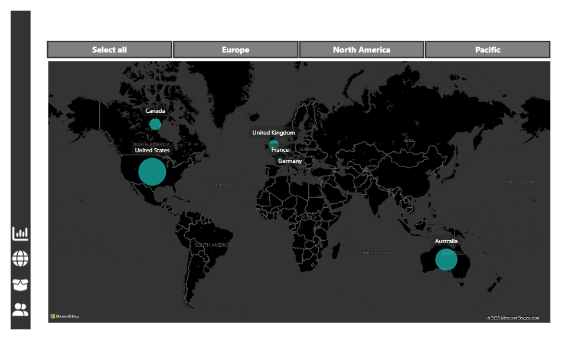

# AdventureWorks Sales Analytics Dashboard

A Power BI report built on the AdventureWorks dataset, analyzing sales, customer, and product performance across an interactive multi-page dashboard.

## Overview

This report gives leadership a single view into sales performance, broken down by executive summary, customer behavior, product mix, and regional distribution. It replaces static spreadsheet reporting with a drillable, filterable dashboard.

## Dashboard Pages

| Page | Purpose |
|---|---|
| **Exec Details** | High-level KPIs and trends for leadership — the "first five seconds" view |
| **Customer Detail** | Customer-level breakdown: segments, order history, retention patterns |
| **Product Detail** | Product-level performance: category mix, top/bottom sellers, margins |
| **Map** | Geographic distribution of sales by region/territory |

## Screenshots

## Dashboard Pages

### Executive Dashboard


### Map Dashboard



### Product Dashboard


### Customer Dashboard


## Key Metrics

- 📈 Total Sales Revenue
- 💰 Total Profit
- 📊 Profit Margin %
- 🛒 Total Orders
- 👥 Total Customers
- 📦 Total Products Sold
- 🌍 Sales by Region (Interactive Map)
- 🏆 Top Products by Sales
- 🥇 Top Product Categories
- 📅 Sales Trend Over Time

## Technical Highlights

- ⭐ Built using a dedicated Measure Table for organized DAX calculations.
- 📊 40+ DAX measures created for KPI tracking, profitability analysis, sales trends, targets, returns, and time intelligence.
- 📅 Implemented time intelligence measures including Previous Month, YTD, and Rolling 10-Day/90-Day calculations.
- 🎯 Created KPI variance measures such as Revenue Target Gap, Profit Target Gap, and Order Target Gap.
- 🗺️ Interactive dashboards with drill-through, slicers, bookmarks, and dynamic filtering.
- ⚡ Optimized data model using a star schema and reusable DAX measures.

### Notable DAX Measures

- Total Revenue
- Total Profit
- Profit Margin %
- YTD Revenue
- Previous Month Revenue
- 90-Day Rolling Profit
- 10-Day Rolling Revenue
- Revenue Target Gap
- Profit Target Gap
- Returned Rate

## Tech Stack

- **Power BI Desktop** — data modeling, DAX measures, report design
- **Power Query (M)** — data transformation and cleaning
- **Custom Visuals**:
  - Race Bar Chart (animated ranking-over-time chart)
  - tCard (KPI card visual)

## Data Source

AdventureWorks sample dataset (Microsoft's standard demo dataset for a fictional bicycle manufacturer), covering sales orders, products, customers, and territories.

## Repository Structure

```
AdventureWorks-Sales-Dashboard/
├── AdventureWorks_Report.pbix     # Main Power BI report file
├── data/                          # Source data files (if not using a live connection)
├── docs/
│   └── screenshots/               # Exported dashboard page images
├── .gitignore
└── README.md
```

## How to Use

1. Clone the repository:
2. Open `AdventureWorks_Report.pbix` in **Power BI Desktop**.
3. If prompted, update the data source path/connection to point to your local AdventureWorks data.
4. Explore the four report pages using the tabs at the bottom.

## Author

Roshan Tuladhar

## License

This project is for portfolio and educational purposes. AdventureWorks is a sample dataset provided by Microsoft.
